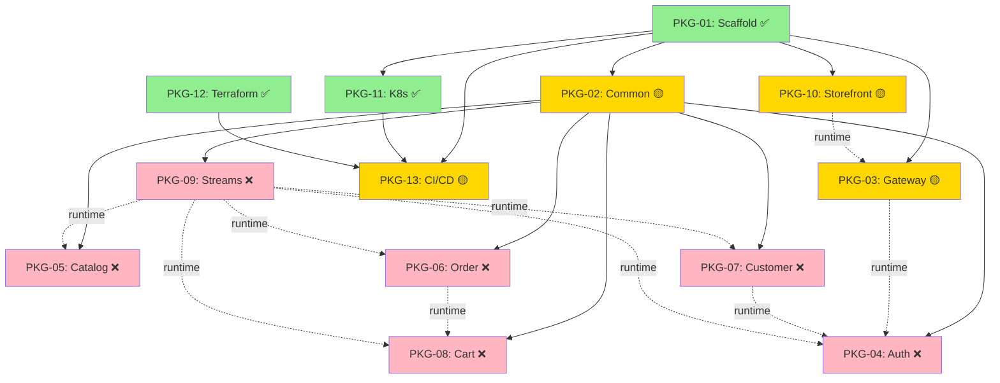

# DachsHaus Implementation Plan

## Executive Summary

This document provides a comprehensive implementation plan for the DachsHaus e-commerce platform. The project is organized into 13 packages (PKG-01 through PKG-13) across 5 development phases. The platform is a polyglot monorepo featuring Kotlin microservices, a TypeScript federation gateway, a Next.js storefront, and GCP infrastructure.

## Current Implementation Status

### ✅ Completed (PKG-01: Monorepo Scaffold)
- **Kotlin Services Structure**: All 7 service directories created (common, auth, catalog, order, customer, cart, streams)
- **Gradle Build System**: Multi-module setup with buildSrc conventions plugin
- **TypeScript Workspace**: pnpm workspace with Turborepo configuration
- **Gateway Shell**: NestJS application structure with core modules
- **Storefront Shell**: Next.js 14 App Router structure with basic pages
- **Infrastructure Base**:
  - Terraform modules: All 10 modules (vpc, gke, cloud-sql, memorystore, secret-manager, artifact-registry, dns, monitoring, kafka)
  - Kubernetes manifests: 52 YAML files in place
  - Docker infrastructure: docker-compose.yml with all services
- **CI/CD Base**: GitHub Actions workflows (ci.yml, deploy.yml)

### 🟡 Partially Complete
- **PKG-02 (Common Module)**: Security and Kafka utilities present (7 files), GraphQL directives missing (3 files)
- **PKG-03 (Gateway)**: Core modules present (13 files), missing tests
- **PKG-10 (Storefront)**: Basic shell exists, missing full implementation

### ❌ Not Started
- **PKG-04 (Auth Service)**: 0 implementation files
- **PKG-05 (Catalog Service)**: 0 implementation files
- **PKG-06 (Order Service)**: 0 implementation files
- **PKG-07 (Customer Service)**: 0 implementation files
- **PKG-08 (Cart Service)**: 0 implementation files
- **PKG-09 (Streams)**: 0 implementation files

---

## Implementation Phases

### Phase 1: Foundation (Parallel) — ✅ COMPLETE
**Estimated Effort**: 2 weeks
**Status**: Complete

#### PKG-01: Monorepo Scaffold ✅
- All directories and build configurations in place
- Docker Compose setup complete
- Makefile with common commands

#### PKG-12: Terraform Infrastructure ✅
- All 10 modules scaffolded
- Environment configs (dev.tfvars, prod.tfvars)
- Output and variable definitions

**Dependencies**: None
**Deliverables**: Runnable scaffold, infrastructure code

---

### Phase 2: Core Platform (After Phase 1)
**Estimated Effort**: 3 weeks
**Status**: 60% complete

#### PKG-02: Common Kotlin Module 🟡
**Status**: 70% complete
**Depends on**: PKG-01 ✅
**Blocks**: PKG-04, PKG-05, PKG-06, PKG-07, PKG-08, PKG-09

**Remaining Work**:
- [ ] Create `AuthDirective.kt` — `@authenticated` GraphQL directive
- [ ] Create `AdminDirective.kt` — `@admin` GraphQL directive
- [ ] Create `ContextBuilder.kt` — builds UserContext for resolvers
- [ ] Write unit tests for `SignatureVerifier` (constant-time comparison)
- [ ] Write integration tests for `GatewaySignatureFilter`

**Files Present**:
- ✅ `GatewaySignatureFilter.kt`
- ✅ `SignatureVerifier.kt`
- ✅ `UserContext.kt`
- ✅ `SecurityConfig.kt`
- ✅ `TopicNames.kt` (11 Kafka topics)
- ✅ `JsonSerde.kt`
- ✅ `DeadLetterPublisher.kt`

**Acceptance Criteria**:
- [ ] Filter rejects invalid signatures with 403
- [ ] Filter rejects expired timestamps (>30s) with 403
- [ ] `@authenticated` directive blocks anonymous requests
- [ ] `DeadLetterPublisher` attaches all 7 diagnostic headers
- [ ] All tests pass

#### PKG-03: Federation Gateway 🟡
**Status**: 85% complete
**Depends on**: PKG-01 ✅
**Runtime Depends on**: PKG-04 (Auth Service `/auth/verify` endpoint)

**Remaining Work**:
- [ ] Write unit tests for `gate.middleware.ts`
- [ ] Write unit tests for `request-signer.ts`
- [ ] Write unit tests for `auth-verify.service.ts` (with LRU cache tests)
- [ ] Write e2e test for complete auth flow
- [ ] Verify TracingPlugin integrates with GCP Cloud Trace

**Files Present**:
- ✅ All source files (13 files)
- ✅ `GateMiddleware` with full auth flow
- ✅ `AuthVerifyService` with 10s LRU cache
- ✅ `RequestSigner` (HMAC-SHA256)
- ✅ `OperationParser`
- ✅ `public-operations.ts` allowlist
- ✅ `HealthController`
- ✅ `TracingPlugin`

**Acceptance Criteria**:
- [ ] Gateway composes supergraph from all subgraphs
- [ ] Unauthenticated public operation → forwarded as anonymous
- [ ] Unauthenticated protected operation → 401
- [ ] Valid token → Auth Service verify called, request signed and forwarded
- [ ] Cache hit (same token <10s) → no Auth Service call
- [ ] `/healthz` returns 200

#### PKG-10: Storefront (Shell Only)
**Status**: 20% complete
**Depends on**: PKG-01 ✅
**Runtime Depends on**: PKG-03 (Gateway)

**Remaining Work**: Defer full implementation to Phase 5

**Files Present**:
- ✅ Basic Next.js 14 App Router structure
- ✅ `layout.tsx`, `page.tsx`, `globals.css`
- ✅ Products route shell

---

### Phase 3: Domain Services (After Phase 2)
**Estimated Effort**: 4 weeks
**Status**: 0% complete

#### PKG-04: Auth Service ❌
**Status**: Not started
**Depends on**: PKG-01 ✅, PKG-02 (complete)
**Critical Path**: YES

**Key Components**:
- REST endpoints: `/auth/verify`, `/.well-known/jwks.json`, `/healthz`
- GraphQL mutations: `login`, `register`, `refreshToken`, `logout`
- `TokenService`: RSA JWT issuance (RS256, 15min/7day TTL)
- `AuthService`: BCrypt(12) password hashing, credential management
- `RevocationService`: In-memory cache + Kafka sync
- `LoginThrottleService`: 5 attempts/15min, 10 consecutive → 30min lockout
- Kafka producer: `user.registered`, `revocations`
- Flyway migrations: 3 tables (credentials, refresh_tokens, revocations)

**Files to Create**: 37 files

**Acceptance Criteria**:
- [ ] `/auth/verify` validates JWT in <5ms
- [ ] `/auth/verify` returns `{ valid: false, reason: "revoked" }` after revocation
- [ ] `register` hashes password with BCrypt(12), publishes event
- [ ] `login` enforces rate limiting (429 after 5 failures)
- [ ] `refreshToken` rotates tokens (single-use)
- [ ] `logout` revokes all refresh tokens, publishes revocation
- [ ] Revocation cache syncs via Kafka across instances
- [ ] JWKS endpoint returns valid RSA public key

#### PKG-05: Catalog Service ❌
**Status**: Not started
**Depends on**: PKG-01 ✅, PKG-02 (complete)

**Key Components**:
- GraphQL subgraph: products (paginated), collections, variants
- Federation entity: `Product @key(fields: "id")`
- `VariantDataLoader`: Batch loading for N+1 prevention
- `CatalogService`: Product CRUD, inventory management
- Kafka producer: `catalog.products`, `catalog.inventory`
- Flyway migrations: 4 tables (products, variants, collections, collection_products)
- Admin-only mutations with `@admin` directive

**Files to Create**: 32 files

**Acceptance Criteria**:
- [ ] `products` query returns paginated results with cursor pagination
- [ ] Federation entity resolver resolves Product references
- [ ] `VariantDataLoader` executes 1 SQL query for N products
- [ ] `createProduct` rejects non-admin users
- [ ] `updateInventory` publishes event to Kafka
- [ ] Search filter uses PostgreSQL full-text search

#### PKG-07: Customer Service ❌
**Status**: Not started
**Depends on**: PKG-01 ✅, PKG-02 (complete)
**Runtime Depends on**: PKG-04 (consumes Kafka events)

**Key Components**:
- GraphQL subgraph: `me` query, profile updates, addresses, wishlist
- `AuthEventConsumer`: Creates customer from `user.registered` (idempotent)
- `CustomerEventProducer`: Publishes profile changes
- Federation entity: `Customer @key(fields: "id")`
- Flyway migrations: 3 tables (customers, addresses, wishlists)
- NO password columns (credentials owned by Auth Service)

**Files to Create**: 28 files

**Acceptance Criteria**:
- [ ] `AuthEventConsumer` creates customer on user registration
- [ ] Consumer is idempotent (duplicate events handled gracefully)
- [ ] `me` returns authenticated user's profile
- [ ] `addAddress` with `isDefault: true` unsets previous default
- [ ] Wishlist operations are idempotent

#### PKG-08: Cart Service ❌
**Status**: Not started
**Depends on**: PKG-01 ✅, PKG-02 (complete)
**Critical Path**: YES

**Key Components**:
- Redis-backed cart with O(1) operations per item
- GraphQL subgraph: cart queries and mutations
- Federation entity: `Cart @key(fields: "userId")`
- `CartRedisRepository`: Low-level Redis operations (HSET, HGETALL, EXPIRE)
- `CatalogClient`: Product validation before adding to cart
- `CartSnapshotService`: Async PostgreSQL dump for analytics
- Kafka producer: `cart.updated`, `cart.checked-out`
- Internal RPC: `checkoutAndClear()` for Order Service

**Redis Data Model**:
```
Key:    cart:{userId}     (Hash)
Field:  item:{variantSku} → JSON { productId, sku, qty, priceCents, addedAt }
TTL:    30 days (reset on write)
```

**Performance Targets**:
- `addToCart`: <5ms p99
- `getCart`: <10ms p99
- 100k+ ops/sec per instance

**Files to Create**: 23 files

**Acceptance Criteria**:
- [ ] `addToCart` validates product via CatalogClient
- [ ] Adding same SKU updates quantity (no duplicates)
- [ ] `updateCartItemQuantity(qty: 0)` removes item
- [ ] Cart TTL resets to 30 days on every write
- [ ] `checkoutAndClear` is atomic (no race conditions)
- [ ] Redis operations verified O(1) per item
- [ ] Integration tests with Testcontainers Redis

---

### Phase 4: Event Processing (After Phase 3)
**Estimated Effort**: 3 weeks
**Status**: 0% complete

#### PKG-06: Order Service ❌
**Status**: Not started
**Depends on**: PKG-01 ✅, PKG-02 (complete)
**Runtime Depends on**: PKG-08 (Cart Service)
**Critical Path**: YES

**Key Components**:
- GraphQL subgraph: orders, checkout, subscriptions
- `CheckoutOrchestrator`: Calls Cart Service → creates order → publishes event
- `OrderStatusSubscription`: WebSocket-based live updates
- Sealed class hierarchy: `OrderPlaced`, `OrderConfirmed`, `OrderShipped`, `OrderCancelled`
- `InventoryResponseConsumer`: Listens for reservation results from Streams
- Federation: Extends `Customer` with `orders` field
- Flyway migrations: 2 tables (orders, order_items)

**Checkout Flow**:
1. Call `cartClient.checkoutAndClear(userId)`
2. Validate cart not empty
3. Create Order (PENDING)
4. Publish `OrderPlaced` to Kafka
5. Return `CheckoutResult`

**Order Status State Machine**:
```
PENDING → CONFIRMED → PAID → FULFILLING → SHIPPED → DELIVERED
PENDING → CANCELLED (inventory failed)
CONFIRMED → CANCELLED (customer cancel)
Any → REFUNDED (admin)
```

**Files to Create**: 38 files

**Acceptance Criteria**:
- [ ] `checkout` atomically reads cart, creates order, publishes event
- [ ] `checkout` with empty cart returns error
- [ ] `orderStatusChanged` subscription delivers real-time updates
- [ ] `InventoryResponseConsumer` transitions order state correctly
- [ ] Sealed class hierarchy is exhaustive in when expressions
- [ ] Order status transitions validated (no invalid transitions)

#### PKG-09: Kafka Streams Processors ❌
**Status**: Not started
**Depends on**: PKG-01 ✅, PKG-02 (complete)
**Runtime Depends on**: All services (consumes their events)
**Critical Path**: YES

**Key Components**:
- `InventoryTopology`: OrderPlaced → stock check → InventoryReserved/Failed
- `OrderEnrichmentTopology`: Joins order + customer + product
- `NotificationTopology`: OrderConfirmed/Shipped → notification outbox
- Custom serdes: `OrderEventSerde`, `ProductEventSerde`, `EnrichedOrderSerde`
- `InventoryStoreConfig`: Persistent RocksDB state store
- Exactly-once semantics (`exactly_once_v2`)

**InventoryTopology Logic**:
```
Input:  dachshaus.order.events (filter: OrderPlaced)
State:  inventory-store (from catalog.inventory, compacted)
Logic:
  - For each item: check stock, deduct if available
  - All-or-nothing reservation (no partial)
  - Emit InventoryReserved or InventoryFailed
```

**Files to Create**: 23 files

**Acceptance Criteria**:
- [ ] InventoryTopology correctly deducts stock (all-or-nothing)
- [ ] InventoryTopology emits InventoryFailed on insufficient stock
- [ ] OrderEnrichmentTopology produces enriched orders with full details
- [ ] NotificationTopology routes correct template per event type
- [ ] All topologies tested with TopologyTestDriver
- [ ] Failed messages land in DLQ with diagnostic headers
- [ ] State store survives restart (persistent RocksDB)

---

### Phase 5: Production Readiness (After All Services)
**Estimated Effort**: 3 weeks
**Status**: 0% complete

#### PKG-10: Storefront (Complete) 🔄
**Status**: Shell exists, full implementation pending
**Depends on**: PKG-01 ✅
**Runtime Depends on**: PKG-03 (Gateway)

**Key Components**:
- Apollo Client with SSR, auth link, WebSocket split
- Auth context: login, register, logout, token refresh
- 10 routes: homepage, products, product detail, collection, cart, checkout, orders, order detail, login, register, admin
- Components: ProductCard/Grid, CartDrawer, CheckoutForm, OrderStatusBadge
- Custom hooks: `useProducts`, `useCart`, `useOrderTracking`
- Typed GraphQL operations from `@dachshaus/graphql-schema`

**Auth Flow**:
1. Login/Register → receives `{ accessToken, refreshToken }`
2. `accessToken` in memory (AuthContext state)
3. `refreshToken` in HttpOnly cookie (secure, sameSite: strict)
4. On mount: server-side refresh check → Next.js API route
5. On 401: errorLink → logout

**Pages**:
| Route | Access | Features |
|---|---|---|
| `/` | public | Featured collections, SSR |
| `/products` | public | Grid, pagination, filters |
| `/products/[slug]` | public | Detail, variant selector, add to cart |
| `/collections/[slug]` | public | Collection products |
| `/cart` | public | Full cart, qty editing |
| `/checkout` | protected | Address, place order |
| `/orders` | protected | Order history |
| `/orders/[id]` | protected | Detail + live subscription |
| `/auth/login` | public | Login form |
| `/auth/register` | public | Registration form |
| `/admin/products` | admin | Product CRUD |

**Files to Create**: 67+ files

**Acceptance Criteria**:
- [ ] Product listing loads with SSR (view source shows data)
- [ ] Adding to cart updates count immediately (optimistic)
- [ ] Login stores tokens, subsequent requests include Authorization header
- [ ] Page refresh with valid refresh cookie restores session
- [ ] Order detail shows live status via WebSocket subscription
- [ ] Protected routes redirect to `/auth/login` when unauthenticated
- [ ] All operations use generated types

#### PKG-11: Kubernetes Manifests ✅
**Status**: Base complete, testing pending
**Depends on**: PKG-01 ✅

**Infrastructure Present**:
- ✅ 52 Kubernetes YAML files
- ✅ Namespaces, network policies, Istio configs
- ✅ Per-service: Deployment, Service, HPA, ServiceAccount
- ✅ Strimzi Kafka CRDs
- ✅ Kustomize overlays (dev/prod)
- ✅ External Secrets integration

**Remaining Work**:
- [ ] Test `kubectl apply -k k8s/overlays/dev`
- [ ] Verify network policies block unauthorized access
- [ ] Verify Istio mTLS enforcement
- [ ] Test HPA scaling behavior
- [ ] Verify External Secrets pull from Secret Manager

#### PKG-13: CI/CD Pipelines 🟡
**Status**: Workflows present, needs validation
**Depends on**: PKG-01 ✅, PKG-11, PKG-12

**Files Present**:
- ✅ `.github/workflows/ci.yml`
- ✅ `.github/workflows/deploy.yml`

**Remaining Work**:
- [ ] Add `terraform-plan.yml` workflow (PR comments)
- [ ] Create `.github/dependabot.yml`
- [ ] Create `.github/CODEOWNERS`
- [ ] Test full CI pipeline (lint + test)
- [ ] Test full CD pipeline (build → push → deploy)
- [ ] Verify smoke tests catch broken deploys
- [ ] Document rollback procedure

**Acceptance Criteria**:
- [ ] CI catches compilation errors before merge
- [ ] Terraform plan comments on PRs with diff
- [ ] Deploy completes in <15 minutes (parallel builds)
- [ ] Failed smoke test fails workflow
- [ ] Rollback via `kubectl rollout undo` works

---

## Critical Path Analysis

The **critical path** determines the minimum time to implement the entire platform:

```
PKG-01 (done) → PKG-02 → PKG-04 (Auth) → PKG-08 (Cart) → PKG-06 (Order) → PKG-09 (Streams)
```

**Critical Path Duration**: ~10 weeks (excluding PKG-01)

### Why These Packages Are Critical:
1. **PKG-02 (Common)**: Blocks all Kotlin services
2. **PKG-04 (Auth)**: Gateway needs `/auth/verify` endpoint
3. **PKG-08 (Cart)**: Order Service calls `checkoutAndClear()`
4. **PKG-06 (Order)**: Streams processes `OrderPlaced` events
5. **PKG-09 (Streams)**: Inventory reservation completes checkout flow

### Parallelization Opportunities:
- Phase 3: PKG-05 (Catalog) and PKG-07 (Customer) can be built in parallel with PKG-04/PKG-08
- Phase 5: PKG-10 (Storefront), PKG-11 (K8s), PKG-13 (CI/CD) are independent

---

## Dependency Graph



Legend:
- ✅ Green: Complete
- 🟡 Yellow: Partially complete
- ❌ Pink: Not started
- Solid lines: Build-time dependencies
- Dotted lines: Runtime dependencies

---

## Implementation Strategy

### Recommended Approach: Vertical Slice

Instead of completing all services horizontally (all resolvers, then all repositories, etc.), implement **vertical slices** that deliver end-to-end functionality:

#### Slice 1: User Registration & Authentication (3 weeks)
**Goal**: Users can register, login, and receive JWT tokens

**Work Items**:
1. Complete PKG-02 (Common Module) — 3 files + tests
2. Complete PKG-04 (Auth Service) — 37 files
3. Complete PKG-07 (Customer Service) — 28 files (depends on Auth events)
4. Update PKG-03 (Gateway) — finish tests
5. Build minimal Auth UI in PKG-10 — login/register forms

**Demo**: User can register → receive JWT → login → see profile

---

#### Slice 2: Product Browsing (2 weeks)
**Goal**: Users can view products and collections

**Work Items**:
1. Complete PKG-05 (Catalog Service) — 32 files
2. Build product listing UI in PKG-10 — products page, product detail, collections

**Demo**: User can browse products, see variants, view collections

---

#### Slice 3: Shopping Cart (2 weeks)
**Goal**: Users can add items to cart and view cart

**Work Items**:
1. Complete PKG-08 (Cart Service) — 23 files
2. Build cart UI in PKG-10 — cart drawer, cart page, quantity controls

**Demo**: User can add products to cart, update quantities, see total

---

#### Slice 4: Checkout & Order Processing (3 weeks)
**Goal**: Users can place orders and see order status updates

**Work Items**:
1. Complete PKG-06 (Order Service) — 38 files
2. Complete PKG-09 (Streams) — 23 files (inventory reservation)
3. Build checkout UI in PKG-10 — checkout form, order confirmation, order tracking

**Demo**: User can checkout → order placed → inventory reserved → order confirmed → live status updates

---

#### Slice 5: Production Deployment (2 weeks)
**Goal**: Platform deployable to GCP with CI/CD

**Work Items**:
1. Validate PKG-11 (K8s) — test deployments
2. Complete PKG-13 (CI/CD) — add missing workflows
3. Test full deployment to GCP

**Demo**: Commit to main → CI passes → deploys to GCP → smoke tests pass

---

## Key Milestones

| Milestone | Date (Estimated) | Deliverables | Acceptance Criteria |
|---|---|---|---|
| **M1: Foundation Complete** | Week 0 | PKG-01, PKG-12 | ✅ Done |
| **M2: Auth & Customer** | Week 3 | PKG-02, PKG-04, PKG-07 | Users can register and login |
| **M3: Product Catalog** | Week 5 | PKG-05 | Admin can create products, users can browse |
| **M4: Shopping Cart** | Week 7 | PKG-08 | Users can add items to cart |
| **M5: Checkout & Orders** | Week 10 | PKG-06, PKG-09 | Users can place orders, see live status |
| **M6: Production Ready** | Week 12 | PKG-10, PKG-11, PKG-13 | Platform deployed to GCP with CI/CD |

---

## Risk Assessment

### High-Risk Items

| Risk | Impact | Mitigation |
|---|---|---|
| **Kafka Streams complexity** (PKG-09) | Critical path blocker | Start with InventoryTopology only, defer enrichment |
| **Federation gateway composition failures** (PKG-03) | Blocks all GraphQL clients | Extensive e2e tests, graceful degradation |
| **Redis performance issues** (PKG-08) | Cart service bottleneck | Load testing, Redis cluster if needed |
| **HMAC signature verification bugs** (PKG-02) | Security vulnerability | Constant-time comparison, thorough testing |
| **JWT revocation sync delays** (PKG-04) | Auth bypass window | Short-lived access tokens (15min), monitoring |

### Medium-Risk Items

| Risk | Impact | Mitigation |
|---|---|---|
| **Database migration failures** | Service startup failures | Flyway with rollback scripts, test on dev first |
| **Terraform state corruption** | Infrastructure drift | Remote state in GCS, state locking |
| **N+1 query problems** | Performance degradation | DataLoaders for all 1-to-N relationships |
| **WebSocket subscription failures** (PKG-06) | No live order updates | Fallback to polling, reconnection logic |

---

## Testing Strategy

### Unit Tests
- **Target**: 80% code coverage (excluding trivial getters/setters)
- **Tools**: JUnit 5 (Kotlin), Jest (TypeScript)
- **Focus**: Business logic, serdes, signature verification

### Integration Tests
- **Target**: All external integrations (DB, Redis, Kafka)
- **Tools**: Testcontainers (PostgreSQL, Redis, Kafka)
- **Focus**: Repository layer, Kafka producers/consumers

### End-to-End Tests
- **Target**: Critical user flows (register → login → browse → cart → checkout)
- **Tools**: Playwright (storefront), GraphQL request tests (services)
- **Focus**: Federation gateway, auth flow, checkout orchestration

### Load Tests
- **Target**: 10k concurrent users, 100k cart ops/sec
- **Tools**: k6, custom Redis benchmark
- **Focus**: Cart service, gateway, Kafka Streams throughput

---

## Deployment Strategy

### Environments

| Environment | Purpose | Resources | Access |
|---|---|---|---|
| **Local** | Developer workstations | docker-compose | All developers |
| **Dev** | Integration testing | GKE (n1-standard-2, 3 nodes) | CI + developers |
| **Staging** | Pre-production validation | GKE (n1-standard-4, 5 nodes) | CI + QA |
| **Production** | Live traffic | GKE (n1-standard-8, 10+ nodes, autoscale) | CI only |

### Deployment Process

1. **PR Opened**: CI runs lint + tests, Terraform plan comments
2. **PR Merged to Main**:
   - Terraform apply (if infra changes)
   - Docker build + push (parallel, 8 images)
   - Kustomize set image (update to new SHA)
   - kubectl apply -k overlays/dev
   - Smoke tests (health checks, sample GraphQL query)
3. **Tagged Release**: Same as above, but deploys to staging → production

### Rollback Procedure
```bash
# Fast rollback (previous deployment)
kubectl rollout undo deployment/<service> -n dachshaus-services

# Rollback to specific version
kubectl rollout undo deployment/<service> --to-revision=N -n dachshaus-services

# Verify rollback
kubectl rollout status deployment/<service> -n dachshaus-services
```

---

## Monitoring & Observability

### Metrics (GCP Cloud Monitoring)
- **Gateway**: Request rate, latency (p50/p95/p99), error rate, auth cache hit rate
- **Services**: GraphQL operation latency, resolver errors, DB connection pool size
- **Kafka**: Consumer lag, partition lag, rebalance count
- **Redis**: Memory usage, eviction rate, p99 latency
- **Streams**: Processing lag, state store size, rebalancing

### Alerts
- Consumer lag > 1000 messages for 5 minutes
- Database CPU > 80% for 10 minutes
- Redis memory > 90% for 5 minutes
- Pod restart count > 3 in 10 minutes
- Gateway error rate > 5% for 2 minutes

### Logging
- Structured JSON logs (all services)
- Correlation ID propagation (X-Request-Id)
- GCP Cloud Logging with log-based metrics

### Tracing
- Istio service mesh (automatic span collection)
- GCP Cloud Trace integration via `TracingPlugin` (PKG-03)
- Critical paths: checkout flow, GraphQL query resolution

---

## Package Reference

### Quick Status Overview

| Package | Name | Status | Blocks | Critical Path |
|---|---|---|---|---|
| PKG-01 | Monorepo Scaffold | ✅ Complete | PKG-02, PKG-03, PKG-10, PKG-11 | YES |
| PKG-02 | Common Module | 🟡 70% | PKG-04-09 | YES |
| PKG-03 | Gateway | 🟡 85% | - | No |
| PKG-04 | Auth Service | ❌ Not started | - | YES |
| PKG-05 | Catalog Service | ❌ Not started | - | No |
| PKG-06 | Order Service | ❌ Not started | - | YES |
| PKG-07 | Customer Service | ❌ Not started | - | No |
| PKG-08 | Cart Service | ❌ Not started | - | YES |
| PKG-09 | Streams | ❌ Not started | - | YES |
| PKG-10 | Storefront | 🟡 20% | - | No |
| PKG-11 | Kubernetes | ✅ Base done | PKG-13 | No |
| PKG-12 | Terraform | ✅ Complete | PKG-13 | No |
| PKG-13 | CI/CD | 🟡 60% | - | No |

### File Count by Package

| Package | Total Files | Completed | Remaining |
|---|---|---|---|
| PKG-02 | 12 | 7 | 5 (3 GraphQL directives + 2 tests) |
| PKG-03 | 18 | 13 | 5 (tests) |
| PKG-04 | 37 | 0 | 37 |
| PKG-05 | 32 | 0 | 32 |
| PKG-06 | 38 | 0 | 38 |
| PKG-07 | 28 | 0 | 28 |
| PKG-08 | 23 | 0 | 23 |
| PKG-09 | 23 | 0 | 23 |
| PKG-10 | 67+ | ~10 | ~57 |
| PKG-13 | 5 | 2 | 3 |

**Total Implementation Files Remaining**: ~243 files

---

## Next Steps

### Immediate Actions (Week 1)

1. **Complete PKG-02 (Common Module)**
   - Implement 3 GraphQL directives
   - Write comprehensive tests
   - Validate HMAC constant-time comparison

2. **Complete PKG-03 (Gateway) Tests**
   - Unit tests for middleware, signer, auth service
   - E2e test for complete auth flow
   - Verify tracing integration

3. **Start PKG-04 (Auth Service)**
   - Set up database schema (Flyway migrations)
   - Implement TokenService with RSA key generation
   - Implement AuthService with BCrypt hashing

### Week 2-3: Auth & Customer

4. **Complete PKG-04 (Auth Service)**
   - Implement REST endpoints (/auth/verify, /jwks)
   - Implement GraphQL mutations (login, register, refresh, logout)
   - Implement RevocationService with Kafka sync
   - Implement LoginThrottleService
   - Write comprehensive tests

5. **Complete PKG-07 (Customer Service)**
   - Implement AuthEventConsumer (idempotent)
   - Implement GraphQL resolvers (me, updateProfile, addresses, wishlist)
   - Write tests

6. **Integration Testing**
   - Test full auth flow: register → login → verify → refresh → logout
   - Test customer creation via Kafka event
   - Test gateway → auth service integration

### Week 4-5: Catalog

7. **Complete PKG-05 (Catalog Service)**
   - Implement all GraphQL resolvers
   - Implement VariantDataLoader
   - Implement Kafka producers
   - Write tests with product search

### Week 6-7: Cart

8. **Complete PKG-08 (Cart Service)**
   - Implement Redis repository
   - Implement cart operations
   - Implement CatalogClient integration
   - Load test Redis performance

### Week 8-10: Orders & Streams

9. **Complete PKG-06 (Order Service)**
   - Implement CheckoutOrchestrator
   - Implement WebSocket subscriptions
   - Implement InventoryResponseConsumer

10. **Complete PKG-09 (Streams)**
    - Implement InventoryTopology
    - Implement OrderEnrichmentTopology
    - Implement NotificationTopology
    - Test with TopologyTestDriver

### Week 11-12: Production

11. **Complete PKG-10 (Storefront)**
    - Implement all pages and components
    - Implement Apollo Client setup
    - Implement auth context and hooks

12. **Complete PKG-13 (CI/CD)**
    - Add terraform-plan workflow
    - Add dependabot config
    - Test full CI/CD pipeline

13. **Final Validation**
    - Deploy to GCP dev environment
    - Run smoke tests
    - Load testing
    - Security review

---

## Success Criteria

### Technical Success
- [ ] All 13 packages implemented
- [ ] 80%+ test coverage
- [ ] All acceptance criteria met
- [ ] Platform deployable to GCP via CI/CD
- [ ] Load tests pass (10k users, 100k cart ops/sec)

### Business Success
- [ ] Complete e-commerce flow: register → browse → cart → checkout → order tracking
- [ ] Live order status updates via WebSocket
- [ ] Admin can manage products
- [ ] Sub-100ms p95 latency for reads
- [ ] Sub-500ms p95 latency for writes

### Operational Success
- [ ] 99.9% uptime SLO
- [ ] < 5 minute MTTR (mean time to recovery)
- [ ] Automated deployments with rollback
- [ ] Comprehensive monitoring and alerting
- [ ] Zero critical security vulnerabilities

---

## Appendix: Package Specifications

For detailed specifications of each package, refer to:
- `.claude/packages/pckg_02.md` — Common Kotlin Module
- `.claude/packages/pckg_03.md` — Federation Gateway
- `.claude/packages/pckg_04.md` — Auth Service
- `.claude/packages/pckg_05.md` — Catalog Service
- `.claude/packages/pckg_06.md` — Order Service
- `.claude/packages/pckg_07.md` — Customer Service
- `.claude/packages/pckg_08.md` — Cart Service
- `.claude/packages/pckg_09.md` — Kafka Streams
- `.claude/packages/pckg_10.md` — Storefront
- `.claude/packages/pckg_11.md` — Kubernetes
- `.claude/packages/pckg_12.md` — Terraform
- `.claude/packages/pckg_13.md` — CI/CD

---

**Document Version**: 1.0
**Last Updated**: 2026-03-09
**Maintainer**: DachsHaus Development Team
